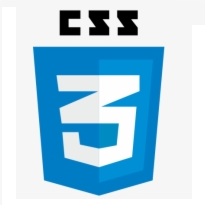

 

  

 <h1> Hi 👋 </h1>
<h5>- 🔭 I’m currently working on Clean House (is my project)</h5>  
<h5>- 🌱 I’m currently learning Python</h5>                        
<h5>- ❤️ I love Java and it's my favorite language ❤️</h5>         
<h5>- 💬 Ask me about JavaScript, React and ❤️JAVA❤️</h5>          
 
  

  
  

 <td style="border: none;">

  

  

 
       
 
Social Media      
-------------------------------------------------------------------------------------------------------      
       

