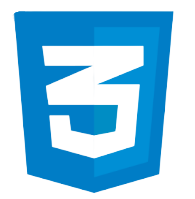

   
    
<h1> Hi 👋 </h1>
<h5>- 🔭 I’m currently working on Clean House (is my project)</h5>  
<h5>- 🌱 I’m currently learning Python</h5>                        
<h5>- ❤️ I love Java and it's my favorite language ❤️</h5>         
<h5>- 💬 Ask me about JavaScript, React and ❤️JAVA❤️</h5>          

Languages and Tools      
-------------------------------------------------------------------------------------------------------      
       
 
Social Media      
-------------------------------------------------------------------------------------------------------      
       

